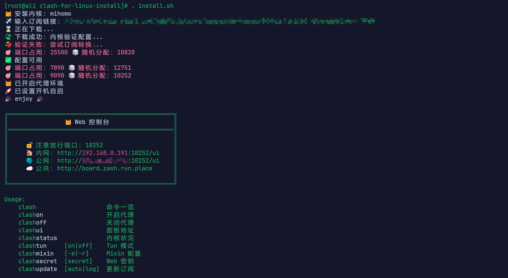

# Linux 一键安装 Clash



- 默认安装 `mihomo` 内核，[可选安装](https://github.com/nelvko/clash-for-linux-install/wiki/FAQ#%E5%AE%89%E8%A3%85-clash-%E5%86%85%E6%A0%B8) `clash`。
- 自动进行本地订阅转换。
- 多架构支持，适配主流 `Linux` 发行版：`CentOS 7.6`、`Debian 12`、`Ubuntu 24.04.1 LTS`。
- **新增Docker容器支持**，无需systemd也能运行。

> 如遇问题，请在查阅[常见问题](https://github.com/nelvko/clash-for-linux-install/wiki/FAQ)及 [issue](https://github.com/nelvko/clash-for-linux-install/issues?q=is%3Aissue) 未果后进行反馈。

- 上述克隆命令使用了[加速前缀](https://gh-proxy.com/)，如失效请更换其他[可用链接](https://ghproxy.link/)。
- 默认通过远程订阅获取配置进行安装，本地配置安装详见：[issue#39](https://github.com/nelvko/clash-for-linux-install/issues/39)
- 没有订阅？[click me](https://次元.net/auth/register?code=oUbI)
- 验证是否连通外网：`wget www.google.com`

## 一、标准环境安装与使用

### 1. 环境要求

- 需要 `root` 或 `sudo` 权限
- 具备 `bash` 和 `systemd` 的系统环境

### 2. 一键安装

下述命令适用于 `x86_64` 架构，其他架构请戳：[一键安装-多架构](https://github.com/nelvko/clash-for-linux-install/wiki#%E4%B8%80%E9%94%AE%E5%AE%89%E8%A3%85-%E5%A4%9A%E6%9E%B6%E6%9E%84)

```bash
git clone --branch master --depth 1 https://gh-proxy.com/https://github.com/nelvko/clash-for-linux-install.git \
  && cd clash-for-linux-install \
  && sudo bash -c '. install.sh; exec bash'
```

### 3. 命令一览

执行 `clash` 列出开箱即用的快捷命令。

```bash
$ clash
Usage:
    clash                    命令一览
    clashon                  开启代理
    clashoff                 关闭代理
    clashui                  面板地址
    clashstatus              内核状况
    clashtun     [on|off]    Tun 模式
    clashmixin   [-e|-r]     Mixin 配置
    clashsecret  [secret]    Web 密钥
    clashupdate  [auto|log]  更新订阅
```

### 4. 开始使用

```bash
$ clashoff
😼 已关闭代理环境

$ clashon
😼 已开启代理环境

$ clashui
😼 Web 面板地址...
```

原理：

- 使用 `systemctl` 控制 `clash` 启停，并调整代理环境变量的值（http_proxy 等）。应用程序在发起网络请求时，会通过其指定的代理地址转发流量，不调整会造成：关闭代理但未卸载代理变量导致仍转发请求、开启代理后未设置代理地址导致请求不转发。
- `clashon` 等命令封装了上述流程。

### 5. 定时更新订阅

```bash
$ clashupdate https://example.com
👌 备份配置：/opt/clash/config.yaml.bak
🍃 下载成功：内核验证配置...
✅ [2025-02-23 22:45:23] 订阅更新成功：https://example.com

$ clashupdate auto [url]
😼 定时任务设置成功

$ clashupdate log
✅ [2025-02-23 22:45:23] 订阅更新成功：https://example.com
...
```

- `clashupdate` 会记忆安装和更新成功时的订阅，后续执行无需再指定订阅 `url`。
- 可通过 `crontab -e` 修改定时更新频率及订阅链接。
- 通过配置文件进行更新：[pr#24](https://github.com/nelvko/clash-for-linux-install/pull/24#issuecomment-2565054701)

### 6. Web 控制台密钥

控制台密钥默认为空，若暴露到公网使用建议更新密钥。

```bash
$ clashsecret 666
😼 密钥更新成功，已重启生效

$ clashsecret
😼 当前密钥：666
```

### 7. `Tun` 模式

```bash
$ clashtun
😾 Tun 状态：关闭

$ clashtun on
😼 Tun 模式已开启
```

- 作用：实现本机及 `Docker` 等容器的所有流量路由到 `clash` 代理、DNS 劫持等。
- 原理：[clash-verge-rev](https://www.clashverge.dev/guide/term.html#tun)、 [clash.wiki](https://clash.wiki/premium/tun-device.html)。

### 8. `Mixin` 配置

```bash
$ clashmixin
😼 查看 mixin 配置（less）

$ clashmixin -e
😼 编辑 mixin 配置（vim）

$ clashmixin -r
😼 查看 运行时 配置（less）
```

- 作用：用来存储自定义配置，防止更新订阅后覆盖丢失自定义配置内容。
- 运行时配置是订阅配置和 `Mixin` 配置的并集。
- 相同配置项优先级：`Mixin` 配置 > 订阅配置。

### 9. 卸载

以下为通用命令，`root` 用户可直接使用： `. uninstall.sh`。

```bash
sudo bash -c '. uninstall.sh; exec bash'
```

## 二、Docker环境安装与使用

### 1. 环境要求

- 需要 `root` 或类似权限
- 仅需 `bash`，**无需 systemd**
- 适用于各种容器环境，如Docker、LXC等

### 2. 一键安装

在Docker容器中，无需systemd也能安装使用Clash：

```bash
git clone --branch master --depth 1 https://gh-proxy.com/https://github.com/SongJunguo/clash_for_linux_or_docker.git \
  && cd clash_for_linux_or_docker \
  && bash -c '. install.sh; exec bash'
```

安装流程会自动检测Docker环境，并使用适合容器的方式安装Clash。

### 3. 关键命令

Docker环境中使用以下命令管理Clash：

```bash
# 启动Clash并设置代理环境变量
source /opt/clash/start_clash.sh

# 停止Clash并清除代理环境变量
source /opt/clash/stop_clash.sh

# 在新终端窗口中设置代理环境变量
source /opt/clash/set_proxy.sh

# 更新配置文件
/opt/clash/update_config.sh [订阅链接]
```

**重要说明**：在Docker环境中，每次打开新的终端窗口，环境变量不会自动保留，需要手动运行 `source /opt/clash/set_proxy.sh` 来设置代理环境变量，否则新终端将无法使用代理连接外网。

### 4. 使用特点

Docker环境下的Clash在`/opt/clash`目录中安装，主要特点：

- **无需systemd**：使用脚本和PID文件方式管理进程
- **自动识别环境**：安装脚本会自动检测是否为Docker环境
- **便捷启停**：使用source命令确保环境变量正确设置
- **Web控制台**：默认地址`http://127.0.0.1:9000/ui`
- **新会话支持**：使用`set_proxy.sh`脚本在新终端窗口中快速设置代理环境变量

容器重启注意事项：
- 每次容器启动后需要手动执行：`source /opt/clash/start_clash.sh`
- 每次打开新终端窗口需要执行：`source /opt/clash/set_proxy.sh`
- 可以将启动命令添加到容器的启动脚本中自动执行

### 5. 配置文件结构

Docker环境中的配置文件：

- 主配置文件：`/opt/clash/config.yaml`
- Mixin配置文件：`/opt/clash/mixin.yaml`
- 运行时配置：`/opt/clash/runtime.yaml`

### 6. 更新订阅

在Docker环境中使用专门的更新脚本：

```bash
# 使用新的订阅链接更新
/opt/clash/update_config.sh https://5ca0cc9b-6fb5-3054-8463-22992d190605.nginx24zfd.xyz/link/3V2cBMVKr3jvZsHw?clash=1

# 使用之前保存的链接更新
/opt/clash/update_config.sh

# 更新后重启Clash
source /opt/clash/stop_clash.sh
source /opt/clash/start_clash.sh
```

### 7. 端口映射

如需从容器外部访问Web控制台，请确保映射以下端口：

- 9000端口：Web控制台
- 7890端口：HTTP代理
- 7891端口：SOCKS代理

例如Docker运行命令：
```bash
docker run -p 7890:7890 -p 7891:7891 -p 9000:9000 -d your-container-image
```

### 8. 卸载

Docker环境中使用以下命令卸载：

```bash
bash -c '. uninstall.sh; exec bash'
```

## 引用

- [Clash 知识库](https://clash.wiki/)
- [Clash 家族下载](https://www.clash.la/releases/)
- [Clash Premium 2023.08.17](https://downloads.clash.wiki/ClashPremium/)
- [mihomo v1.19.2](https://github.com/MetaCubeX/mihomo)
- [subconverter v0.9.0：本地订阅转换](https://github.com/tindy2013/subconverter)
- [yacd v0.3.8：Web UI](https://github.com/haishanh/yacd)
- [yq v4.45.1：处理 yaml](https://github.com/mikefarah/yq)

## Thanks

[@鑫哥](https://github.com/TrackRay)
[@nelvko](https://github.com/nelvko/clash-for-linux-install)
## 特别声明

1. 编写本项目主要目的为学习和研究 `Shell` 编程，不得将本项目中任何内容用于违反国家/地区/组织等的法律法规或相关规定的其他用途。
2. 本项目保留随时对免责声明进行补充或更改的权利，直接或间接使用本项目内容的个人或组织，视为接受本项目的特别声明。
# 更新于 Fri Mar  7 22:18:23 CST 2025
# 再次更新于 Fri Mar  7 22:32:40 CST 2025
